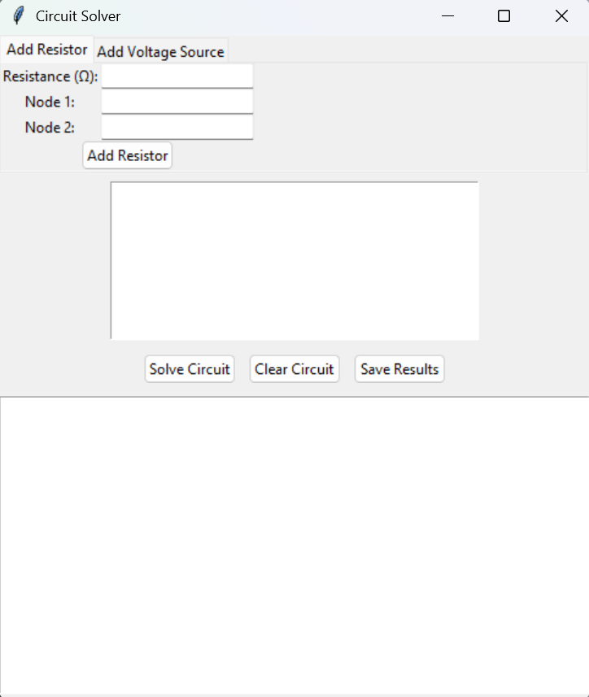
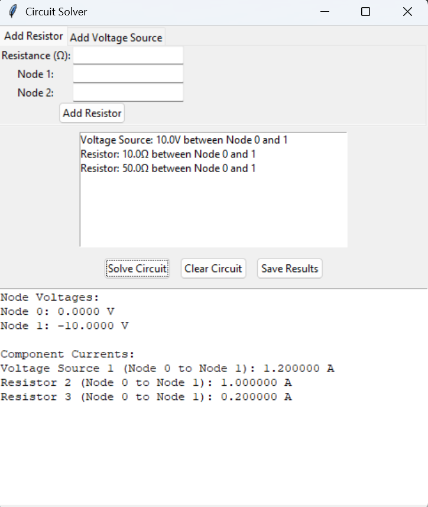

# Basic DC Circuit Simulator

A Python-based application for designing and analyzing **DC electrical circuits** using **Modified Nodal Analysis (MNA)**. The simulator features a graphical user interface (GUI) built with Tkinter, enabling users to create circuits, perform analysis, and obtain node voltages and branch currents efficiently.

---

## Overview

This project demonstrates the application of **Object-Oriented Programming (OOP)** principles in solving real-world engineering problems. Circuit elements such as resistors and voltage sources are modeled as objects, while Modified Nodal Analysis is used to formulate and solve the underlying system equations.

The project was developed as an academic exercise to explore the intersection of **Software Engineering** and **Electrical Engineering**.

---

## Features

* Graphical User Interface (GUI) developed using Tkinter
* Support for resistors and independent voltage sources
* Circuit analysis using Modified Nodal Analysis (MNA)
* Object-Oriented design with inheritance and polymorphism
* Automatic calculation of node voltages and branch currents
* Real-time component tracking and management
* Save simulation results to text files
* User-friendly error handling for invalid circuits

---

## Application Preview

### Main Interface



### Circuit Configuration


### Simulation Results




---

## Technologies Used

| Technology                        | Purpose                                   |
| --------------------------------- | ----------------------------------------- |
| Python                            | Core programming language                 |
| Tkinter                           | Graphical User Interface                  |
| NumPy                             | Numerical computations and matrix solving |
| Modified Nodal Analysis (MNA)     | Circuit analysis technique                |
| Object-Oriented Programming (OOP) | Software design approach                  |

---

## Working Principle

The simulator follows the steps below:

1. The user defines circuit elements such as resistors and voltage sources.

2. The system constructs the circuit equations using **Modified Nodal Analysis (MNA)**.

3. The resulting matrix equation is formulated as:

   **Gx = I**

   where:

   * **G** = Conductance matrix
   * **x** = Unknown node voltages and source currents
   * **I** = Current/voltage vector

4. NumPy's linear algebra solver computes the solution.

5. The calculated node voltages and component currents are displayed through the GUI.

---

## Installation

### Prerequisites

* Python 3.x
* NumPy

### Clone the Repository

```bash
git clone https://github.com/abhinavpradeep13/Basic-DC-Circuit-Simulator.git
cd Basic-DC-Circuit-Simulator
```

### Install Dependencies

```bash
pip install numpy
```

### Run the Application

```bash
python dc_circuit_simulator.py
```

---

## Example Use Case

Consider a circuit containing:

* Voltage Source: 12 V
* Resistor R1: 100 Ω
* Resistor R2: 200 Ω

The simulator can be used to:

* Define the circuit components
* Construct the circuit model
* Solve the circuit equations
* Display node voltages and branch currents

This makes the application useful for both **educational purposes** and **basic circuit verification tasks**.

---

## Project Structure

```text
Basic-DC-Circuit-Simulator/
│
├── dc_circuit_simulator.py
├── README.md
├── images/
│   ├── homepage.png
│   ├── circuit_example.png
│   └── result.png
│
└── docs/
    └── dc_circuit_simulator.pptx
```

---

## Documentation

A detailed presentation explaining the project architecture, implementation, and analysis methodology is included in this repository.

**Project Presentation:**

* `docs/DC_Circuit_Simulator_Presentation.pptx`

The presentation covers:

* Project objectives
* Object-Oriented design approach
* Modified Nodal Analysis (MNA)
* GUI implementation using Tkinter
* Simulation outputs
* Applications and future scope

---

## Future Improvements

Potential enhancements include:

* Support for current sources
* Inclusion of capacitors and inductors
* Circuit schematic editor with drag-and-drop functionality
* Saving and loading circuit configurations
* Enhanced visualization and reporting features
* Extension toward SPICE-like simulation capabilities

---

## Educational Value

This project helped strengthen understanding of:

* Object-Oriented Programming concepts
* GUI development using Tkinter
* Numerical methods in engineering
* Matrix-based circuit analysis techniques
* Software design for engineering applications

---

## Author

**Abhinav Pradeep**

If you have any suggestions or feedback regarding this project, feel free to reach out or open an issue in the repository.

