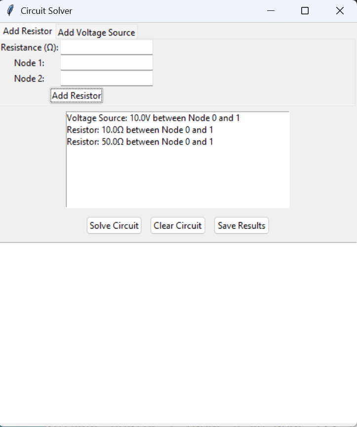

# Basic DC Circuit Simulator

A Python-based application for designing and analyzing **DC electrical circuits** using **Modified Nodal Analysis (MNA)**. The simulator provides an intuitive graphical user interface built with Tkinter, allowing users to define circuit components, solve circuit equations, and visualize analysis results.

---

## Features

* Graphical User Interface (GUI) built using Tkinter
* Support for resistors and independent voltage sources
* Circuit analysis using Modified Nodal Analysis (MNA)
* Object-Oriented Programming (OOP) architecture
* Real-time tracking of circuit components
* Calculation of node voltages and branch currents
* Export analysis results to a text file
* User-friendly error handling for invalid circuit configurations

---

## Application Preview

### Main Interface


### Circuit Configuration



### Simulation Results


---

## Technical Stack

* **Programming Language:** Python
* **GUI Framework:** Tkinter
* **Numerical Computation:** NumPy
* **Design Approach:** Object-Oriented Programming (OOP)
* **Analysis Technique:** Modified Nodal Analysis (MNA)

---

## How It Works

The simulator models electrical components as objects and constructs a system of equations representing the circuit using **Modified Nodal Analysis (MNA)**.

The resulting matrix equation is solved using NumPy's linear algebra capabilities to determine:

* Node voltages
* Branch currents
* Overall circuit behavior

---

## Installation

### Prerequisites

* Python 3.x
* NumPy

### Clone the Repository

```bash
git clone https://github.com/abhinavpradeep13/Basic-DC-Circuit-Simulator.git
cd Basic-DC-Circuit-Simulator
```

### Install Dependencies

```bash
pip install numpy
```

### Run the Application

```bash
python dc_circuit_simulator.py
```

---

## Example Use Case

Consider a simple DC circuit consisting of:

* Voltage Source: 12 V
* Resistor R1: 100 Ω
* Resistor R2: 200 Ω

Using the simulator, users can define the circuit components, perform analysis, and obtain the corresponding node voltages and branch currents.

---

## Project Structure

```text
Basic-DC-Circuit-Simulator/
│
├── dc_circuit_simulator.py
├── README.md
└── images/
    ├── homepage.png
    ├── circuit_example.png
    └── result.png
```

---

## Future Improvements

* Support for additional components (capacitors, inductors, current sources)
* Circuit schematic drawing interface
* Visualization of current flow
* Saving and loading circuit configurations
* Enhanced plotting and reporting capabilities

---

## Educational Purpose

This project was developed to strengthen understanding of:

* Circuit analysis techniques
* Modified Nodal Analysis
* Numerical methods in engineering
* Object-Oriented Programming principles
* GUI application development in Python

---

## Author

**Abhinav Pradeep**

If you found this project interesting, feel free to explore the repository and provide feedback.
